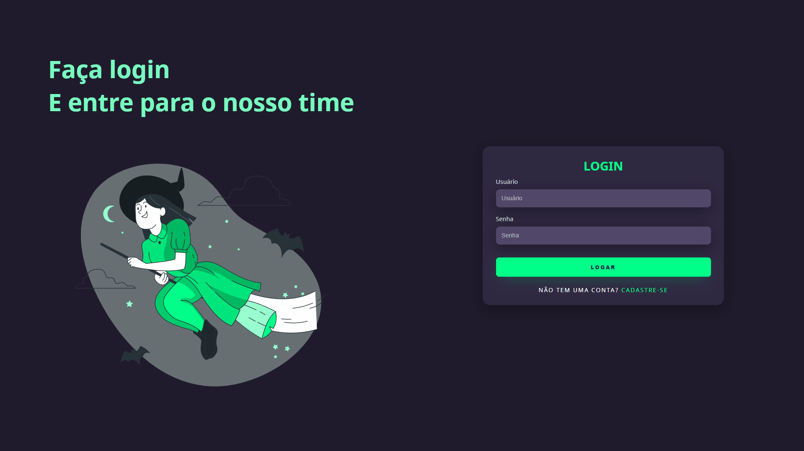

# Login FrontPage - About this project

One of my first experiences with HTML & Css, I decided to learn a little more with a [YouTube tutorial video](https://www.youtube.com/watch?v=69-WfrVBli8) from [lexmarcos](https://github.com/lexmarcos), it was a tutorial that gave me a lot of learning mainly about CSS, alignment and use of SVG.

